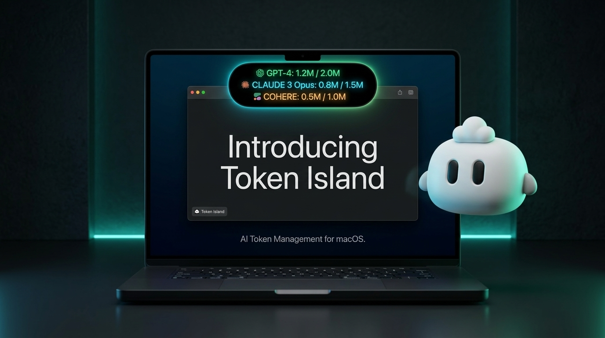

# Token Island 🏝️

<p align="center">
  <strong>A sleek, lightweight, multi-display native macOS Dynamic Island for real-time Codex and Antigravity quota tracking.</strong>
</p>

<p align="center">
  
</p>

<p align="center">
  
  
  
  
</p>

<p align="center">
  <a href="#-overview">Overview</a> •
  <a href="#-key-features">Key Features</a> •
  <a href="#-ui--interaction">UI & Interaction</a> •
  <a href="#-installation--build">Installation</a> •
  <a href="#-privacy--security">Privacy</a> •
  <a href="#-acknowledgments">Acknowledgments</a> •
  <a href="README_CN.md">中文文档</a>
</p>

---

## 📖 Overview

**Token Island** is a native macOS application engineered specifically for developers using **ChatGPT / Codex** and **Google Antigravity (Gemini 3.7 / Pro, Claude 3.7 / Opus, GPT models)**. 

Instead of cluttering your menu bar or navigating complex setting pages, **Token Island** turns your MacBook's physical notch (and external display borders) into an interactive, pure OLED black Dynamic Island that delivers authoritative, millisecond-accurate rate limits at a glance.

---

## ✨ Key Features

- 🎯 **Tailor-Made for Codex & Antigravity**:
  - **Antigravity**: Direct local LanguageServer RPC HTTPS integration (`RetrieveUserQuotaSummary`) for 100% authoritative rate limit tracking (Gemini 5h / Weekly, Claude/GPT 5h / Weekly, reset countdowns).
  - **ChatGPT / Codex**: Real-time `wham/usage` session synchronization (5-hour window, 7-day all-models quota, reset credits balance).
- 🏝️ **Native MacBook Notch Integration**:
  - Sits as an ultra-compact `92px × 26px` pure black pill inside the notch when idle.
  - Hovering gently expands into a sleek, pixel-perfect floating dashboard.
- 🖥️ **Multi-Display Synchronized**:
  - Automatically detects all connected displays (built-in Liquid Retina XDR + external 4K/5K monitors).
  - Anchors a dedicated Dynamic Island at the top of each screen with independent hover listeners.
- 🛡️ **Pixel-Level Anti-Misclick**:
  - Hover triggers *only* when the cursor physically touches the `92px` pill. Moving around the top-center area will never disrupt your workflow.
- 📐 **35px Safety Margin**:
  - The expanded card starts cleanly **35px below the screen top**, ensuring zero occlusion by the camera notch or menu bar.
- 🎨 **Provider-Specific Color Schemes**:
  - 🟢 **ChatGPT / Codex**: OpenAI Emerald Green (`#10A37F`)
  - 🔵 **Gemini**: Google Electric Cyan (`#38D1FA`)
  - 🟠 **Claude / GPT**: Anthropic Warm Amber (`#FA9440`)
- 🔄 **Adaptive Single/Dual Provider Layout**:
  - Automatically collapses and adjusts its height if only Codex or only Antigravity is active on the machine.
- 🛑 **Discreet Right-Click Context Menu**:
  - Right-click anywhere on the island to trigger **Instant Refresh** or **Quit Token Island**.

---

## 🖥️ UI & Interaction

### 1. Standby Pill (Idle Mode)
```
[ 0% / 68% ]   <-- Compact 92px OLED black pill (Codex 5h% / 1w%)
```

### 2. Expanded Dashboard (Hover Mode)
```
┌─────────────────────────────────────────────────────────────┐
│ ⚙️ CHATGPT                                                  │
│   Current session                                       0%  │
│   [▰▱▱▱▱▱▱▱▱▱▱▱▱▱▱▱▱▱▱▱▱▱▱▱▱▱▱▱▱▱▱▱] (Emerald)         │
│   ⌛ 2h 45m                                        🕒 20:09 │
│   ● All models: %68 (Emerald)                       5d 15h  │
│   ───────────────────────────────────────────────────────── │
│   🔄 Reset credits                                       1  │
│      first expires in 22d 13h                               │
├─────────────────────────────────────────────────────────────┤
│ ∧ ANTIGRAVITY                                               │
│   Gemini                                               74%  │
│   [▰▰▰▰▰▰▰▰▰▰▰▰▰▰▰▰▰▰▰▰▰▰▰▱▱▱▱▱▱▱▱] (Cyan)            │
│   ⌛ 2h 23m                                        🕒 19:47 │
│   ● Gemini: %83 (Cyan)                              1d 1h   │
│   ───────────────────────────────────────────────────────── │
│   Claude/GPT                                          100%  │
│   [▰▰▰▰▰▰▰▰▰▰▰▰▰▰▰▰▰▰▰▰▰▰▰▰▰▰▰▰▰▰▰▰] (Amber)           │
│   ⌛ 4h 58m                                        🕒 22:21 │
│   ● Claude/GPT: %23 (Amber)                         1d 1h   │
├─────────────────────────────────────────────────────────────┤
│            Keep going. You’re closer than you think.        │
│                              yupi                           │
└─────────────────────────────────────────────────────────────┘
```

---

## 🚀 Installation & Build

### Prerequisites
- macOS 14.0 (Sonoma) or later
- Swift 5.9+ / Xcode Command Line Tools

### Build from Source
```bash
# Clone the repository
git clone https://github.com/your-username/token_island.git
cd token_island

# One-click build and install
chmod +x build_app.sh
./build_app.sh
```

### Launch on Startup (Recommended)
1. Open **System Settings** ➔ **General** ➔ **Login Items & Extensions**.
2. Under **Open at Login**, click the **`+`** button.
3. Select `/Applications/token_island.app` and confirm.

---

## 🔒 Privacy & Security

- **100% Local & Safe**: No analytics, no third-party trackers, no remote telemetry.
- **Zero Key Leaks**: Never hardcodes API keys or personal access tokens. All data is read locally on-device through official localhost RPC sockets and session tokens.

---

## 💡 Acknowledgments

- Quota protocol insights inspired by [mimir](https://github.com/erayendes/mimir).
- Built with ❤️ in native Swift & SwiftUI.

---

## 📄 License

This project is open-source software licensed under the [MIT License](LICENSE).
