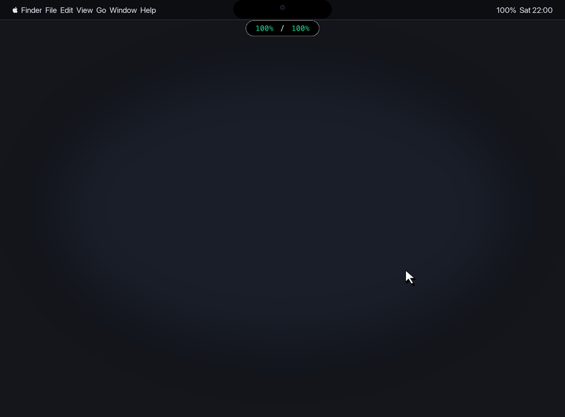

# Token Island 灵动岛 🏝️

<p align="center">
  <strong>专为 Codex 与 Google Antigravity 打造的原生 macOS 多屏刘海灵动岛配额监测神器</strong>
</p>

<p align="center">
  
</p>

<p align="center">
  
  
  
  
</p>

---

## 📖 项目简介

**Token Island** 是一款使用原生 Swift + SwiftUI 开发的高性能、轻量级 macOS 顶部灵动岛应用，专为使用 **ChatGPT / Codex** 与 **Google Antigravity（Gemini 3.7 / Pro、Claude 3.7 / Opus 等模型）** 的开发者设计。

告别繁琐的菜单栏点击与后台配置查看，**Token Island** 将您的 MacBook 物理刘海（以及外接显示器顶部）化身为纯黑 OLED 交互灵动岛，毫秒级实时掌握大模型速率限制与配额刷新倒计时。

---

## ✨ 核心特性

- 🎯 **专为 Codex 与 Antigravity 深度定制**：
  - **Antigravity**：直连本地运行的官方 LanguageServer 语言服务 RPC（`RetrieveUserQuotaSummary`），100% 权威抓取 Gemini 5h/周配额、Claude/GPT 5h/周配额及精确刷新时刻。
  - **ChatGPT / Codex**：直连官方 `wham/usage` 会话接口，实时同步 5 小时会话、7 天总配额以及重置点数（Reset Credits）。
- 🏝️ **物理刘海极窄胶囊**：
  - 待机时仅占 **`92px × 26px`**，纯黑背景紧密包裹在 MacBook 物理摄像头刘海中；
  - 鼠标触碰刘海时，0 延迟展开超高颜值的纯黑高质感数据卡片。
- 🖥️ **多显示器全屏联动（Multi-Display）**：
  - 自动识别所有连接的屏幕（内置 Liquid Retina 屏 + 外接 4K/5K 显示器），每个屏幕顶部均挂载独立的灵动岛控制器。
- 🛡️ **像素级防误触算法**：
  - 仅当光标**真正触碰 92px 小胶囊**时触发展开，在屏幕中央正常移动光标、操作网页、点击菜单栏绝不误弹。
- 📐 **35px 菜单栏安全向下避让**：
  - 展开卡片精确从**菜单栏正下方（下移 35px）**起始，彻底杜绝摄像头刘海遮挡任何文字或图表。
- 🎨 **专属模型品牌色系（告别混乱报警色）**：
  - 🟢 **ChatGPT / Codex**：OpenAI 极客薄荷绿（`#10A37F`）
  - 🔵 **Gemini**：Google 幻彩青蓝（`#38D1FA`）
  - 🟠 **Claude / GPT**：Anthropic 温暖落日橙（`#FA9440`）
- 🔄 **智能自适应单/双服务布局**：
  - 电脑上若仅安装了 Codex 或仅运行了 Antigravity，卡片高度会自动自适应收缩至单张卡片，上下左右四周始终保持绝对对称的 11px 边距。
- 🛑 **右键快捷菜单**：
  - 右键点击胶囊或卡片即可弹出原生菜单，支持 **「立即刷新数据」** 与 **「退出 token_island」**。

---

## 🚀 源码编译与安装

### 环境要求
- macOS 14.0 (Sonoma) 或更高版本
- Swift 5.9+ / Xcode 命令行工具 (`xcode-select --install`)

### 一键编译打包
```bash
# 克隆仓库
git clone https://github.com/your-username/token_island.git
cd token_island

# 执行一键打包脚本
chmod +x build_app.sh
./build_app.sh
```
执行后会自动生成签名好的 `token_island.app` 并安装至 `/Applications` 文件夹！

---

## ⚙️ 设置开机自启动

1. 打开 Mac **「系统设置」** ➔ **「通用」** ➔ **「登录项与扩展」**；
2. 在 **「在登录时打开」** 列表中点击 **`+`** 号；
3. 选择 `/Applications/token_island.app` 添加即可。

---

## 🔒 隐私与安全声明

- **100% 本地运行**：无任何遥测、埋点、统计代码，完全本地离线通信；
- **零密钥泄露风险**：源码中不包含任何个人凭证，所有 Token 均在运行时动态读取本地临时缓存。

---

## 💡 致谢与灵感来源

- 配额获取协议与思路启发自优秀的开源项目 [mimir](https://github.com/erayendes/mimir)。
- 由衷感谢开源社区的分享精神！

---

## 📄 开源协议

本项目采用 [MIT 许可证](LICENSE) 开源。
